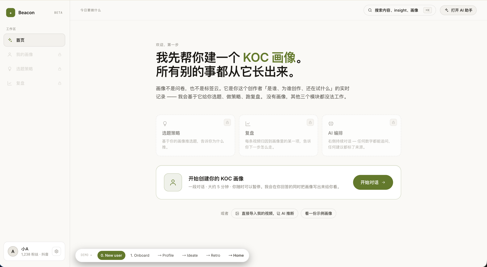
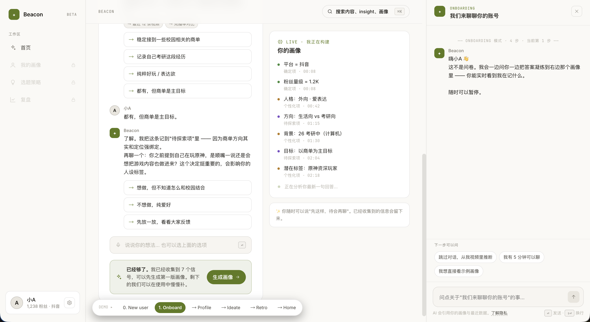
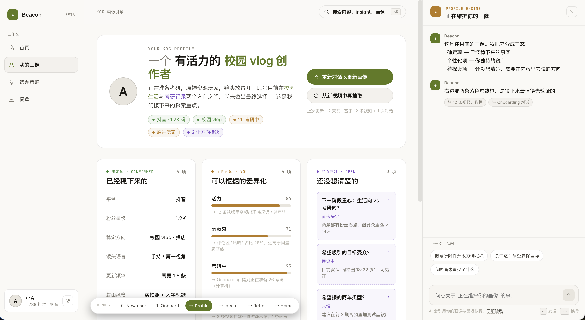
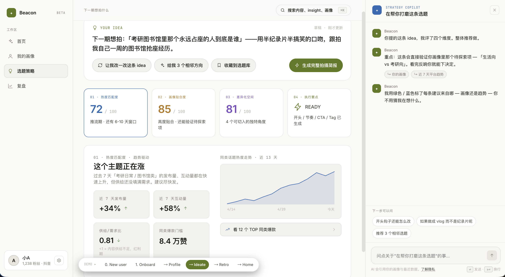
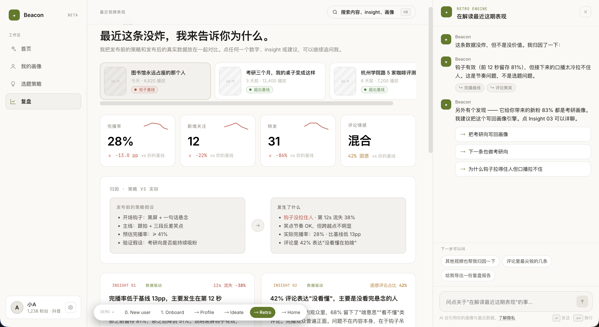
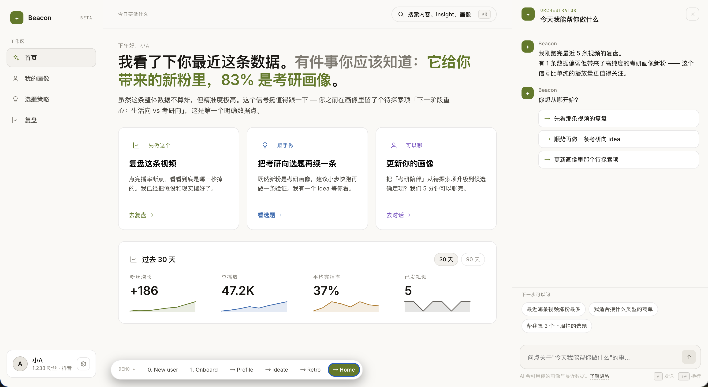

# Echo · koc成长 · 产品说明文档

> 腾讯 PCG 校园 AI 产品创意大赛参赛作品
> 配套材料：本文档为主文档；完整 PRD 与 4 份 agent 技术规范见末尾「附录」章节

---

## 封面页

| 项目 | 内容 |
|---|---|
| 作品名称 | **Echo · koc成长** |
| 参赛赛道 | 题目5：用AI+社媒流量密码，帮助普通KOC轻松涨粉 |
| 选手姓名 | 张知尧 |
| Demo 链接 | https://43-134-72-220.nip.io/ |
| 代码仓库 | https://github.com/RealZYZhang/koc-agent-v2 |

**注**：本demo中有“冷启动”与“热启动”两个版本，分别对应用户新建画像与已有画像的两个登入状态，评委可以切换体验。本demo已经接入LLM。

---

## 速览：我们解决什么问题，凭什么能解决

**总结**：Echo 是面向 1K- ～ 10K+ 粉丝段视频类 KOC 的 **AI 成长伙伴**，把「画像 → 选题 → 复盘」做成可验证、可追溯的闭环，让早期创作者不靠运气也能专业化运营。


| 用户面对的问题 | 我们如何解决 | 用户能获得什么 |
|---|---|---|
| 账号定位模糊，不知道自己适合什么主题、面向谁 | AI 先消化用户历史视频，主动提出带证据的画像假设；画像分「确定 / 个性化 / 待探索」三态，且持续追踪「还在思考的方向」，在新内容中探索| 通过开场与AI对话拿到一份属于自己的画像，后续不断对画像更新、调整|
| 选题不切题、缺方法论，追热点又怕丢失个人色彩 | 双轴策略：每条建议同时基于「画像驱动 + 趋势驱动」交叉判断，强制标注来源（画像驱动 / 趋势驱动 / 数据驱动 / 历史复盘 / 用户偏好驱动） | 拿到带「热度 / 贴合 / 差异 / 执行」四维评估、可执行的拍摄简报，每一句建议都看得到出处 |
| 视频发出去后只有冷冰冰的数字，不知道哪里成了哪里没成，更不知道下次怎么改 | 闭环复盘：发布前的策略快照 vs 实际数据做归因，挖掘评论中的真实诉求，并把验证结果回写画像 | 拿到一份"成功 / 没达预期 / 受众告诉我们的事 / 下一步"四段式洞察，画像随之自动迭代，AI 越用越懂用户 |
| AI 输出像黑箱，不敢用、用了不踏实 | 与分析来源标签强绑定：每条 AI 分析至少有1个来源标签，前端用色卡呈现 | 始终知道 AI 在「凭什么」给建议，建立长期信任 |

---

## 模块一　用户洞察与问题定义

### 1.1 目标用户

**核心用户**：早期视频类 KOC（粉丝量 数百–上万）

- **平台**：抖音、小红书、视频号等为主，产品本身平台无关
- **创作背景**：兴趣驱动、非专业团队、单人或小型组合
- **内容现状**：主题尚未稳定，跨多个垂类摸索（如校园生活、美食探店、学习日常）
- **商业目标**：希望接到与个人定位贴合的小型商单，把爱好变现
- **关键背景**：用户**已经有粉丝和内容基础**，并非从零起步。AI 的角色不是教小白从头做，而是在其既有素材中引导用户找到方向

**典型用户画像 — 小A**：在校大三学生，抖音 1000+ 粉，发布校园 vlog 与食堂探店，正在思考是否把考研内容作为新主轴，希望接到校园生活 / 学业相关商单。

### 1.2 用户痛点

早期 KOC 不是专业团队，没有运营经验，专业技能薄弱。具体表现为：

| # | 痛点 | 后果 |
|---|---|---|
| 1 | **定位模糊**：账号主题不明确或仍在探索 | 账号形象不清晰，受众难匹配，商业价值上不去 |
| 2 | **选题方法论缺失**：选题不切题、不够吸引人，制作节奏混乱 | 完播率、关注率、转发率长期低迷 |
| 3 | **复盘能力弱**：没有结构化分析、归因、迭代能力 | 账号原地踏步，每次发布都像重新赌博 |
<!-- | 4 | **不信任 AI 建议**：现有工具给出的建议像黑箱，无依据、无来源 | 用了几次就放弃，回到拍脑袋决策 | -->

**行业空白**：当前给视频类 KOC 服务的 AI 工具主要集中在「内容生产自动化（剪辑、配音、数字人）」「爆款工业化复刻」「KOC 营销 SaaS」「数据看板」四类（详见 §2.4 创新与差异化），**没有一款产品聚焦于「早期 KOC 的画像建立 + 战略导航」**。早期 KOC 最缺的恰恰不是更多素材，而是有人帮他想清楚自己是谁、该做什么。

### 1.3 使用场景

**场景 A：建立画像**
小A 第一次进入 Echo。AI 已经分析过她 2-5 条历史视频，开口第一句不是问卷，而是「我看完了你的视频，初步感受到三个特征……」。多轮对话内，小A 验证 AI 的假设、补充顾虑、确认尚在探索的方向（如「考研 vs 校园探店」「希望接什么类型广告」）。最终生成一份「确定 / 个性化 / 待探索」三态的 KOC 画像，三个工作模块解锁。此后小A每次进入Echo即可看到自己的画像，并能够针对画像中的每一点与 AI 讨论并修改。

**场景 B：ideate（拍前选题策划）**
小A 想拍「考研期间一日三餐怎么吃才能不困」。AI 拉出她的画像 + 当前趋势数据，给出四维评估（热度 / 贴合 / 差异 / 执行），每条建议都标注来源。小A 觉得钩子太严肃，在右侧 chat dock 追问「能不能轻松一点」，AI 实时调整并解释取舍。最终输出可执行的拍摄简报，并锁定一个重点观察指标作为复盘锚点。

**场景 C：retro（拍后复盘）**
视频发布后，小A 进入复盘模块。AI 把发布前的策略快照与实际数据并列展示：钩子 命中、完播率不达预期、关注转化超预期且是主要指标。小A 点击完播率卡片向下追问「为什么会在第 12 秒掉」，AI 沿证据链给出回答。复盘结束后画像自动更新，AI 越用越懂她。

---

## 模块二　产品方案设计

### 2.1 产品概述

**Echo** 是一个 **结构化 + 对话式双形态** 的 web app：左侧是结构化信息（画像、数据、卡片、图表），右侧是常驻 AI 对话 dock；每一个数据点都是「对话入口」，用户点击即可向下追问。产品端到端做三件事：**建画像 → 给策略 → 做复盘**，完成一次闭环画像就升级一次。

### 2.2 核心功能

产品由 **4 个工作模块 + 1 个常驻 chat dock** 构成：

| 模块 | 解决什么问题 | 核心能力 |
|---|---|---|
| **Onboarding（首次入场）** | 定位模糊、不知道自己是谁 | AI 先做功课 → 三态画像 → 多轮高密度对话 → 实时 LIVE 信息栏让用户看到 AI 在记录什么 |
| **Profile（我的画像）** | 画像不可见、无法演化 | 三态分列展示（确定 / 个性化 / 待探索）、待探索项独立成列且可点击展开、画像更新历史 strip |
| **Ideate（选题策略）** | 选题没方法论、不知道靠不靠谱 | 双轴评估（画像 + 趋势）→ 4 维指标卡 → 差异化角度 → 节奏与 CTA → 重点观察指标锚点 |
| **Retro（复盘）** | 数据冷冰冰、不知道哪里成了 | 策略快照 vs 实际数据并排对比 → 3 张洞察卡 → 评论聚类 → 写回画像 |
| **Chat dock（常驻对话）** | 想对任何元素追问 | Orchestrator 路由 + 5 场景角色化 prompt + 来源标签 强校验 |

<!-- **强约束**：
1. 每条 AI 分析必须至少有 1 个来源标签
2. 画像三态不可合并展示，待探索项必须独立成列
3. Onboarding gate 不可跳过：profile 未生成时 profile / ideate / retro 三个模块锁死
4. Strategy / Retro 的结构化输出必须走 schema 强校验
5. 演示路径上的 LLM 调用必须有缓存兜底 -->

### 2.3 产品架构图

```
┌──────────────────────────────────────────────────────────────┐
│  应用层（Web UI · React 18 + Vite + Tailwind）                │
│  ┌──────────┐  ┌──────────┐  ┌──────────┐  ┌──────────┐     │
│  │  Home    │  │  Profile │  │  Ideate  │  │  Retro   │     │
│  └──────────┘  └──────────┘  └──────────┘  └──────────┘     │
│                ↓ 任意元素可点击 → onAsk(text) →                │
│  ┌──────────────────────────────────────────────────────┐    │
│  │ Chat Dock（Orchestrator · 常驻 · 上下文感知）        │    │
│  └──────────────────────────────────────────────────────┘    │
├──────────────────────────────────────────────────────────────┤
│  Agent 层（FastAPI 后端）                                      │
│  ┌─────────────────┐ ┌─────────────────┐ ┌─────────────────┐ │
│  │ Onboarding Agent│ │ Strategy Agent  │ │ Retro Agent     │ │
│  │ 8 状态 FSM      │ │ 8 状态 FSM      │ │ 9 状态 FSM      │ │
│  └─────────────────┘ └─────────────────┘ └─────────────────┘ │
│  ┌──────────────────────────────────────────────────────┐    │
│  │ Orchestrator Agent（chat dock 兜底 · 两阶段 LLM）    │    │
│  └──────────────────────────────────────────────────────┘    │
├──────────────────────────────────────────────────────────────┤
│  数据层                                                        │
│  ┌──────────────┐ ┌──────────────┐ ┌──────────────┐           │
│  │ Profile Store│ │ Strategy Snap│ │ Insights Rpt │           │
│  └──────────────┘ └──────────────┘ └──────────────┘           │
│  ┌──────────────────────────────────────────────────┐         │
│  │ Mock Data（账号 / 视频 / 评论 / 受众 / 趋势）     │         │
│  └──────────────────────────────────────────────────┘         │
├──────────────────────────────────────────────────────────────┤
│  基础设施                                                      │
│  腾讯云 COS + CloudBase / SCF · DeepSeek v4 三档模型           │
└──────────────────────────────────────────────────────────────┘
```

**核心数据闭环**：

```
mock_data → Onboarding Agent → profile_v1.json
                                  ↓
                          Strategy Agent → strategy_snapshot.json
                                              ↓ （假设视频已发布）
                                       Retro Agent → insights_report.json
                                                       ↓
                                                profile_delta → profile_v2.json
```

每一步的中间产物都持久化为 JSON，可在 demo 中被评委直接查看。

### 2.4 交互流程

#### 2.4.1 关键路径示意：

```
[1] Landing               [2] Onboarding             [3] Profile
   三模块视觉锁定     →       AI 先做功课         →        三态分列
   主要 CTA                 多轮对话                     画像可读可演化
   "开始创建画像"            LIVE 信息栏实时更新           每项可点击追问
        ↓                          ↓                          ↓
[4] Ideate                  [5] Retro                 [6] Home（回访）
   提交 idea          →      对照策略 vs 实际    →        30 天数据
   4 维评估                  3 张洞察卡                  next-action 卡
   重点观察指标锚点            写回画像（v1→v2）            画像更新计数 +1
```

#### 2.4.2 产品原型图：

 **步骤1: Landing**


 **步骤2: Onboarding**


 **步骤3: Profile**


 **步骤4: Ideate**


 **步骤5: Retro**


 **步骤6: Home**



### 2.5 创新与差异化

#### 2.5.1 当前市面 AI 工具的能力分布

| 类别 | 代表产品 | 核心定位 | 服务对象 |
|---|---|---|---|
| **内容生成型 AIGC** | 剪映 AI、Runway、Pika、腾讯智影、百度文心视频 | 替代拍摄 + 剪辑 + 编导（文本→视频、数字人、一键成片） | 任何想批量产内容的创作者 |
| **爆款工业化复刻** | DoLabAI、即创、一帧秒创、MCN 内部系统 | 爆款拆解 → 模板复刻 → 多账号批量生成 | 中腰部 KOL、电商带货账号、MCN |
| **KOC 营销 SaaS** | 微盟「发布有礼」、易创 AI、微播易 | 内容生成 + 任务激励 + 分发追踪 | B 端品牌方、KOC 流量池 |
| **数据策略类** | 评论情绪分析、舆情 AI、内容推荐 AI | 评论挖掘、热点识别、用户偏好建模 | 已经有规模的账号或品牌 |

#### 2.5.2 Echo 的位置：覆盖一个被忽视的窗口

上述 4 类工具有一个共同假设：**用户已经知道自己要做什么内容、面向谁**，工具只负责加速产出或优化分发。但**早期 KOC（1K–10K 粉）最缺的恰恰是这个前置思考**：

- 不缺剪辑工具 — 剪映免费就能用
- 不缺爆款模板 — 复刻爆款会丢掉个人色彩，反而稀释定位
- 不缺批量分发 — 一周一两条精品比每天发 10 条素材更重要
- 不缺数据看板 — 看了也不知道下一步该做什么

**Echo 占据一个空白窗口：早期 KOC 的「画像建立 + 战略导航 + 闭环复盘」**。我们不是又一款剪辑工具，也不是又一个 KOC 流量池，而是创作者的**成长伙伴**。

#### 2.5.3 四层独有差异点

1. **AI 先做功课的 onboarding 范式**
   业界标配是「让用户填空白问卷」（即使披着对话外衣）。Echo 在用户开口前已分析过其全部历史视频，第一句话就是带证据的假设。这把入场门槛从「教 AI 我是谁」反转为「让 AI 先猜，我来纠正」，对非专业用户更友好。（注：在demo中历史视频的分析汇总由mock data代替）

2. **三态画像（确定 / 个性化 / 待探索）**
   主流画像产品只输出「标签云」或「确定项列表」。Echo 把 **「还在思考的方向」** 视为长期追踪的对象——这正是早期 KOC 最焦虑的部分。AI 帮用户陪伴探索，而不是要求用户立刻决定。

3. **双轴策略 + 来源标签 强制契约**
   每条建议同时基于「画像驱动 + 趋势驱动」交叉判断，且必须明示来源（5 元枚举：画像驱动 / 趋势驱动 / 数据驱动 / 历史复盘 / 用户偏好驱动）。这是产品的**信任根基**。

4. **闭环可验证**
   策略阶段，产出策略快照中含 `重点观察指标` ；复盘阶段以同类型历史基线（`baseline_pillar`）作为参考系，逐条对照「假设 vs 实际」，结果回写画像触发 `profile_v{n+1}` 升级。这一步让 AI **迭代式更新画像**，能够越来越懂用户。目前产品没有把 onboarding / ideate / retro 串成同一个数据契约。

---

## 模块三　AI 原生能力说明

### 3.1 AI 核心能力

Echo 是一个AI agent原生产品，**没有 AI 则整个产品形态不成立**。所用 AI 能力包括：

| AI 能力 | 在 Echo 中承担的工作 |
|---|---|
| **用户对话** | onboarding 多轮对话、ideate 选题精修、retro 追问、chat dock 全场景 |
| **结构化推理** | 画像生成、策略评估（4 维打分）、复盘归因 |
| **语义理解** | 消化历史视频脚本、评论聚类、视频退出形状特征解读、假设验证等多源信息 |
| **多 Agent 协作** | 4 个 agent（Onboarding / Strategy / Retro / Orchestrator）按状态机串联，设置3层memory分享机制 |
<!-- | **Agent 路由 + 上下文装配** | Orchestrator 两阶段 LLM：router 决策 needs_slices，主 chat 按需装配切片 | -->

### 3.2 AI 如何解决用户痛点

每一个核心痛点的解决方案都直接绑定 AI 能力：

| 用户痛点 | AI 绑定的解决能力 | 去掉 AI 会变成什么 |
|---|---|---|
| 定位模糊 | LLM 消化全部历史视频 + transcript + 评论，提出带证据的画像假设 | 退化为静态问卷，难以对用户客制化，也没法引导用户探索新内容|
| 选题没方法论 | LLM 联合推理画像 + 趋势 + 历史指标，给出双轴评估 | 丢失用户个性化推荐，难以让KOC产生差异化|
| 复盘能力弱 | LLM 对照策略意图与实际数据做归因，挖掘评论语义理解数据 | 退化为数据看板，没法根据多源信息得到详细结论|
<!-- | 不信任建议 | LLM 输出 + 来源标签 强校验 + schema 契约 | 退化为黑箱推荐，更不信 | -->

### 3.3 AI 技术方案

#### 3.3.1 模型选型

**主模型**：DeepSeek v4，三档调度：

| 模型档位 | 用途 | 选用agent状态 |
|---|---|---|
| `pro-thinking`（高质量 + 高延迟） | 关键深度推理 | Onboarding ANALYZE / Strategy SCORE+STRATEGIZE / Retro COMPARE+ATTRIBUTE+SYNTHESIZE |
| `flash-thinking`（中延迟 + 中等推理） | 对话式生成 | 所有 PRESENT / REFINE / EXPLORE / DRILL / Orchestrator 对话 |
| `flash`（最低延迟 + 快速分类） | 简单分类 | Onboarding VALIDATE 动作分类 / Orchestrator router |

**为什么是 DeepSeek v4**：国产可控、价格低廉、推理质量在中文模型非常高，KV cache hit rate极高导致响应快。

#### 3.3.2 Agent 架构总览

Echo 共 4 个 agent，每个 agent 都遵循统一的**「有限状态机 + 三层 memory + 多段 prompt + schema 强校验」**范式：

```
                    ┌─────────────────────────────────────┐
                    │   前端硬路由（保证状态机自洽）           │
                    │  ideate(已有 snapshot) → strategy/refine│
                    │  retro(已有 report)  → retro/drill   │
                    └──────────────┬──────────────────────┘
                                   │
                                   ↓ 其余全部
                    ┌─────────────────────────────────────┐
                    │  Orchestrator Agent（chat dock 兜底）│
                    │  Stateless · 两阶段 LLM              │
                    │  ROUTE(flash)                        │
                    │   ↓ RouteDecision                   │
                    │  BUILD_CONTEXT(本地 IO)              │
                    │   ↓ profile/strategy/retro 切片       │
                    │  CHAT_STREAM(flash-thinking)         │
                    │   ↓                                 │
                    │  SOURCE_GUARD（强校验，缺则重新生成）   │
                    └─────────────────────────────────────┘

   ┌─────────────────────┬────────────────────┬────────────────────┐
   ↓                      ↓                    ↓                    ↓
Onboarding Agent      Strategy Agent       Retro Agent
8 状态 FSM            8 状态 FSM           9 状态 FSM
INIT→ANALYZE→         RECEIVE_IDEA→        LOAD→COMPARE→
PRESENT→VALIDATE↔     ANALYZE_IDEA→        ATTRIBUTE→
EXPLORE→SUMMARIZE→    SCORE→STRATEGIZE→    EXTRACT_SIGNALS→
FINALIZE→DONE         PRESENT↔REFINE→      SYNTHESIZE→
                      FINALIZE             PRESENT→DRILL→
                                           UPDATE_PROFILE→FINALIZE
   ↓                       ↓                     ↓
profile_v{n}.json     strategy_snapshot.json  insights_report.json
                                              + profile_delta
```

**4 个 agent 的职责**：

- **Onboarding Agent**：把账号原始数据通过多轮对话翻译成一份带证据的三态画像 `profile_v1.json`）
- **Strategy Agent**：把一个 idea 翻译成可执行、可被复盘消费的策略快照（含 `重点观察指标` 锚点，存为 `strategy_snapshot_{id}.json`）
- **Retro Agent**：把一条已发布视频的数据 + 评论翻译成结构化洞察 + 画像更新（存为 `insights_report_{id}.json` + `profile_v{n+1}.json`）
- **Orchestrator Agent**：把 chat dock 里的一句话翻译成带来源标签的回复 + follow-up 建议

#### 3.3.3 三层 Memory（每个 agent 共享的范式）

| Layer | 说明 | 是否进 prompt |
|---|---|---|
| L1 会话工作记忆 | 当前状态相关切片 + 最近 4–6 轮对话，按阶段裁剪 | ✅ 每次进 |
| L2 会话持久化记忆 | 完整分析/报告、对话历史、状态切换日志 | ❌ session 内可调 |
| L3 跨模块共享 | 用户画像 / strategy_snapshot / insights_report 三个 store，是 agent 间的契约接口 | ❌ 通过 schema 消费 |

#### 3.3.4 Schema 强校验

所有结构化输出阶段必须通过schema 校验：

- `profile_v{n}.json` — 三态结构 + 观众假设 + 过往内容校验
- `strategy_snapshot.json` — 热点分析 / 画像契合度 / 差异化 / 执行（含重点观察指标）
- `insights_report.json` — 数据卡 / 策略回顾 / 深入分析 / 建议 / 观众信号
<!-- - `RouteDecision` — Orchestrator 路由输出 -->

<!-- **校验失败 → retry 1 次 → 仍失败回退预跑缓存**。这是 demo 现场不崩的根本保障。 -->

#### 3.3.5 预跑缓存策略

为保证 demo 稳定性，以下深度推理阶段强制预跑并缓存到 `cache/*.json`：

| 阶段 | 缓存文件 | 缓存原因 |
|---|---|---|
| Onboarding ANALYZE | `cache/onb_analyze.json` | 无法一次性深度分析 12–15 条视频，demo缺乏外部接口|
| Strategy SCORE + STRATEGIZE | `cache/strategy_score_strategize.json` | 复杂联合推理，方差大 |
| Retro COMPARE + ATTRIBUTE + EXTRACT_SIGNALS + SYNTHESIZE | `cache/retro_synthesis.json` | 归因分析耗时长，且完全依赖mock data，不需要重复生成|

<!-- 由环境变量 `USE_CACHED_ANALYSIS` 控制；演示走缓存（≤1s 命中），调试可关闭走真实 LLM。 -->
<!-- 
**实时 LLM 保留**（保留「AI 在思考」的临场感）：所有 PRESENT / REFINE / EXPLORE / DRILL / VALIDATE / Orchestrator chat。 -->

#### 3.3.6 工作流总览

```
用户进入 Empty Home
        ↓
    点击 CTA → Onboarding Agent
                  · INIT 加载 mock_data
                  · ANALYZE（pro-thinking · 走缓存）
                  · PRESENT/VALIDATE/EXPLORE 对话循环（flash-thinking 流式）
                  · SUMMARIZE 用户确认
                  · FINALIZE 存入 profile_v1.json
                  ↓
              三模块解锁，进入 Profile / Ideate
                  ↓
          用户提交 idea → Strategy Agent
                            · ANALYZE_IDEA / SCORE / STRATEGIZE（pro-thinking · 走缓存）
                            · PRESENT 自然语言呈现 + 来源标签
                            · REFINE 反馈分类（反对/优化/同意）
                            · FINALIZE 存入 strategy_snapshot.json
                            ↓
                  （demo 假设视频已发布，跳到 retro）
                            ↓
                      Retro Agent
                        · LOAD / COMPARE / ATTRIBUTE / SIGNALS / SYNTHESIZE（pro-thinking · 走缓存）
                        · PRESENT 四段式总览（flash-thinking 流式）
                        · DRILL 用户追问任意元素
                        · UPDATE_PROFILE 写 profile_delta
                        · FINALIZE 存入 insights_report.json + profile_v2.json
                        ↓
                  前端 SSE profile_updated → 自动刷新画像 → 回到 Home
                        ↓
              30 天数据 + 「画像更新频次 +1」 → 闭环完成
```

<!-- 全过程穿插 chat dock：每个 scene 任意可点击元素都通过右上角 ΑΙ 助手进入 Orchestrator 路由，按 scene + 业务上下文做轻量分流，来源标签强校验保证每条 AI 消息都有出处。 -->

#### 3.3.7 各 Agent 的前置输入与未来扩展方向

本节明示每个 agent 当前**假设已知的输入**（demo 中由 mock 提供，未来需要真实接入）与**接下来可以更完善的方向**（按优先级 P0 / P1 / P2 标注：P0 = 上生产前必做，P1 = 重要扩展，P2 = 长期加分）。

**Onboarding Agent**

| 维度 | 内容 |
|---|---|
| **假设已知（输入）** | • 账号身份信息（昵称 / 粉丝数 / 平台 / 注册时长）<br>• 12–15 条历史视频元数据（标题 / 标签 / 发布时间 / 各项指标 / drop_off 曲线 / **完整脚本**）<br>• 每条视频 5–10 条评论文本<br>• 现有粉丝画像快照（年龄 / 性别 / 地域 / 兴趣分布） |
| **当前 demo 简化** | • 上述全部由 `mock_data/*.json` 提供，未真接入抖音 / 小红书 OAuth<br>• 脚本直接给文本，未经转写流程<br>• ANALYZE 阶段走 `cache/onb_analyze.json` 兜底，不在现场跑 LLM |
| **未来可扩展方向** | **[P0] 真实平台数据接入**：对接抖音 / 小红书 / B 站开放平台 OAuth + 数据抓取，替换 mock_data 通路<br>**[P1] 跨 session refresh**：spec 已预留 `session_origin` 字段，后续支持每月 / 每季度自动重新 onboarding，识别画像漂移<br>**[P1] 大样本承载**：当前 12–15 条上限，真实账号可能数百条，需加分批 ANALYZE 与摘要压缩<br>**[P1] 冷启动用户兜底**：粉丝数 < 100 / 视频 < 5 条时数据稀薄，需要降级路径（更多引导式提问 + 更少假设）<br>**[P2] 多模态消化**：当前只读脚本与指标，未来引入封面图 / 关键帧 / 音频特征，画像维度更立体<br>**[P2] 画像导出与互操作**：开放画像 JSON 导出 / 第三方接入接口，让画像成为创作者可携带的数字资产 |

**Strategy Agent**

| 维度 | 内容 |
|---|---|
| **假设已知（输入）** | • 最新版本画像 `profile_v{n}.json`（消费自 Onboarding 输出，含三态、观众、过往分析）<br>• 当前平台 2–3 个候选热度主题数据（热度曲线 / 方向 ）<br>• 用户提交的 idea 文本（idea-driven 模式）或空白请求（discovery 模式）<br>• 历史指标基线（`account_baseline.json`，用于"贴合度"中的同类对比） |
| **当前 demo 简化** | • 热度数据由 `mock_data/external_trends.json` 提供，未接真实趋势 API<br>• Demo 主线只走 idea-driven 路径；spec 中 discovery / system-triggered 模式已有 GENERATE_IDEAS 状态但未在演示路径展示<br>• SCORE + STRATEGIZE 阶段走 `cache/strategy_score_strategize.json` 兜底<br>• Idea 输入仅支持文本（语音 / 图像按钮预留但不实现） |
| **未来可扩展方向** | **[P0] 真实趋势数据源**：对接抖音热点榜 / 小红书趋势 API / 微博热搜 / 百度指数等，建立趋势数据中台<br>**[P0] Discovery 模式产品化**：用户没思路时由待探索项主动 GENERATE_IDEAS 给 2–3 个候选，每条标注"能验证什么假设"<br>**[P1] System-triggered 主动建议**：proactive AI 在画像出现高优先级待探索项时主动推送"我们可以做一期 X 来验证 Y"通知<br>**[P1] 拍摄简报增强**：在执行字段基础上补充 storyboard / 镜头清单 / 钩子 脚本草稿，从"策略"延伸到"准生产输出"<br>**[P1] A/B 策略并行**：同一 idea 给 2 个差异化版本策略，发布后由 retro 阶段做对照归因<br>**[P2] 跨平台策略适配**：同一 idea 在抖音 / 小红书 / B 站的 钩子 与 pacing 自动调整<br>**[P2] 多模态 idea 输入**：用户用语音口述 / 上传参考图，agent 理解后转为结构化 idea |

**Retro Agent**

| 维度 | 内容 |
|---|---|
| **假设已知（输入）** | • 最新版本画像 `profile_v{n}.json`<br>• 这条视频对应的策略快照 `strategy_snapshot_{id}.json`（含 `重点观察指标` 锚点与各项执行假设）<br>• 已发布视频数据：指标（播放 / 完播 / 点赞 / 评论 / 转发 / 关注转化 / 收藏）+ drop_off 曲线（秒级抽样）+ transcript<br>• 评论池：理想数百条，含可触发 insight 的内容反馈 / 受众反馈 / 矛盾点<br>• 历史指标基线 `account_baseline.json`（整体 + 同分类历史均值，用于判定） |
| **当前 demo 简化** | • 全部数据由 mock 提供；预生成 vid_016 / vid_019 / vid_020 三条候选报告，主线走 vid_019<br>• COMPARE / ATTRIBUTE / EXTRACT_SIGNALS / SYNTHESIZE 走 `cache/retro_synthesis.json` 兜底<br>• 评论数量稀薄（5–10 条 / 视频），未做大规模聚类与噪声过滤<br>• "假设视频已发布"：从 ideate 提交后直接跳 retro，跳过真实的发布 → 等待 → 数据稳定流程<br>• Spec 中 batch-review（周 / 月级跨视频复盘）模式 demo 不演示 |
| **未来可扩展方向** | **[P0] 真实视频数据接入**：与 Onboarding 的平台 API 通路共用，发布后自动拉取 metrics + 评论<br>**[P0] Auto-trigger 自动复盘**：发布后 24–48h 数据稳定时自动生成报告并推送，把"主动关心"做成产品可感知的体感<br>**[P1] 大规模评论处理**：上千条评论的语义聚类 + 噪声 / 灌水过滤 + 风险评论标识（黑粉 / 网络暴力）<br>**[P1] Batch-review 周期复盘**：每周 / 每月对一组视频做 meta 级跨视频归因，识别"反复出现的 钩子 失效模式"等共性规律<br>**[P1] 多模态归因**：drop_off 时点与实际画面 / 音频片段对齐，识别"是文案问题 / 画面问题 / 节奏问题"<br>**[P1] Retro → Ideate 直通**：复盘结束后"下一条做什么"按钮直接带着 insight 进 ideate，让闭环形成正反馈<br>**[P2] 跨平台复盘合并**：同一视频在抖音 + 小红书 + B 站的数据合并归因（跨平台基线对齐是难点）<br>**[P2] 长记忆归因**：模型保留每个 KOC 的全部复盘历史，做更细颗粒的"个人化归因模型" |

**Orchestrator Agent**

| 维度 | 内容 |
|---|---|
| **假设已知（输入）** | • 当前 scene 标识（home / onboard / profile / ideate / retro 五选一）<br>• 当前轮 `user_text`（≤ 2000 字符）<br>• 最近若干轮 `chat_history`（router 实际只看末 6 项里最近 2 轮 user/ai）<br>• 可选 `focused_element`（用户点击的元素 id，预留字段当前不消费）<br>• 文件系统中其他 agent 写下的产物：`profile_v{max_n}.json` / 最新 `strategy_snapshot_*.json` / 最新 `insights_report_*.json`，按 router 决策的 `needs_slices` 子集装配 |
| **当前 demo 简化** | • 无状态记忆：每一次调用都从前端把 chat_history 传回来，后端不持久化任何对话<br>• 单画像：只有一个 user_id 对应一套 runtime_data，没有用户隔离<br>• 前端硬路由两条路径绕过 Orchestrator：`scene=ideate` 且已有 snapshot → strategy/refine；`scene=retro` 且已有 report → retro/drill<br>• Source guard 缺 tag 时只做 1 次 retry + fallback 注入，没有离线监控管道分析触发率<br>• Chat dock 只支持文本输入，图像按钮预留但不实现<br>• Router 失败时回退到保守 `FALLBACK_DECISION`（挂全部三个切片），未做更精细的降级 |
| **未来可扩展方向** | **[P0] 多用户隔离**：runtime_data 按 user_id 分目录，鉴权与会话路由完整化（上生产前必做）<br>**[P0] 来源标签 离线监控管道**：`used_fallback=true` 事件做 ETL 入数仓，监控 fallback 触发率与 source 分布，是产品质量的核心指标<br>**[P1] 跨 session 长记忆**：用户在不同时间提到的偏好 / 决策 / 取舍沉淀为长记忆，下次自动召回（当前完全靠前端 zustand）<br>**[P1] Proactive AI 通知中枢**：复盘到位、画像漂移、新趋势涌现等触发主动消息，从 reactive chat 升级为 proactive partner<br>**[P1] 多模态对话**：用户上传截图 / 视频片段 / 语音追问，结合视觉与音频上下文回答<br>**[P1] 个人语气适配**：根据用户既往回应风格调整 tone（简洁 / 详尽 / 共情 / 数据流），写入 profile 用户偏好驱动池<br>**[P2] 团队协作**：MCN / 工作室场景下，多个 KOC 共用同一团队画像，Orchestrator 区分"个人 vs 团队"语境<br>**[P2] 更多 scene 接入**：商单匹配 / 数据看板 / 同行对比等扩展模块，Orchestrator 只需新增 `scene_<name>.txt` prompt |

---

## 模块四　加分项

### 4.1 落地可行性

**技术成熟度**：

- 前端：React 18 + Vite + TypeScript + Tailwind + Radix/shadcn — 全部主流稳定栈
- 后端：Python 3.11 + FastAPI + pydantic v2 — LLM 生态最成熟语言
- LLM：DeepSeek v4 OpenAI-compatible 接口，对接成本极低
- 部署：腾讯云 COS（前端静态托管）+ CloudBase / SCF（后端容器）+ DeepSeek API

**开发节奏**（实际进度 · 截至 2026-05-06）：

| 里程碑 | 状态 |
|---|---|
| M0 项目初始化 | ✅ |
| M1 Mock 数据与 Schema | ✅ |
| M2 设计 Tokens 与 Shell | ✅ |
| M3 5 个 Scene 静态实现 | ✅ |
| M4 Onboarding Agent | ✅ |
| M5 Strategy Agent | ✅ |
| M6 Retro Agent | ✅ |
| M7 Orchestrator + 来源标签 | ✅ |
| M8 闭环演示与故事线打磨 | 🟡 进行中 |
| M9 腾讯云部署 | ✅ |
<!-- | M10 风险演练与冷热备 | ⏳ 待补 | -->

**所需资源评估**（小规模上线版本）：

- 1 名全栈工程师持续投入（已由参赛个人 + Claude Code 协作完成 demo）
- 腾讯云：1 个 COS 桶（前端）+ 1 个 SCF 函数 / CloudBase 容器（后端）+ HTTPS 证书
- DeepSeek API key：单 key 驱动三档模型，按用量计费
- 风险点：真实落地的关键依赖是**平台数据接入**（抖音 / 小红书开放 API 或用户授权），demo 阶段以 mock 数据规避

### 4.2 商业化思考

**目标市场分层**：

| 阶段 | 服务对象 | 模式 |
|---|---|---|
| 短期（0–6 个月） | C 端早期 KOC（1K–10K 粉） | 免费版 + 增值订阅（更高频 retro、更长画像历史、自定义话题） |
| 中期（6–18 个月） | B 端 MCN 机构 / 校园运营团队 | 按席位订阅，多账号画像批量管理，跨账号 insight 复盘 |
| 长期（18 个月+） | 平台 / 品牌方 | 商单匹配抽佣（Echo 沉淀的画像与策略历史是天然资产）、平台数据合作、品牌定制 insight 服务 |

**竞争优势锚点**：

1. **场景占位**：早期 KOC 画像 + 战略导航是被现有工具忽视的窗口，先发占位
2. **数据飞轮**：每个用户的「画像 → 策略 → 复盘」闭环都在沉淀结构化数据，越多用户越能反哺模型与策略库
3. **信任契约**：来源标签 + schema 校验把 AI 黑箱透明化，是用户长期留存的根基
4. **平台无关**：所有 schema 中的 `platform` 字段为枚举，可同一画像支撑多平台运营，未来扩展成本低

<!-- **伦理边界**：
- 用户拥有自己的画像与对话数据，随时可导出
- 不主动抓取用户其他平台账号信息，所有外部数据由用户授权
- 画像数据不出境，不向第三方分享个人化数据
- 商业化路径不依赖出售用户画像数据 -->

---

## 5　产品设计复盘

> **目的**：本复盘不记录工程难题，只总结 demo 准备过程中关于 AI 产品体验、信任设计、流程编排的方法论启示，供未来做产品时参考。

### 5.1 等待真空 — 让用户实时看到 AI 在做什么

LLM 推理有不可消除的延迟，几秒到几十秒都正常。如果界面只显示 spinner，用户会陷入"真空"——不知道 AI 是在思考还是已经卡死，几秒就开始焦虑。

**真实等待时间和体感等待时间是两件事**。在不能让模型更快的前提下，让用户**看到 AI 正在做什么**就足以解决体感问题：流式逐字渲染、流式 thinking 过程、侧边栏实时显示"AI 已经记录到什么"、状态步骤可见化、结果预加载。所有这些手段成本都很低，价值远大于换更快的模型。

**启示**：设计 AI 产品时，第一条需求应是"每个等待节点用户能看到什么"。任何超过 2 秒的等待都必须有内容填充，哪怕只是一行"正在分析…"。让 AI 的工作过程**可见**，比让 AI **变快**更有杠杆。

### 5.2 透明度即信任 — 让用户校验得到 AI 的依据

用户对 AI 建议天然怀疑"凭什么"。如果 AI 给出结论却说不出依据，结果只有两种：盲从（误导风险）或不信（卸载风险）。**信任不能靠营销文案，必须做进交互**。

迭代过程中我们把透明度逐步做深：从纯自由文本，到每条消息标注来源，再到把推理过程摊开成可点击的结构化元素，让用户能向下追问任意一个数据点。每多展示一层依据，用户对建议的接受度就上一个台阶。当 AI 没有依据时，**承认"不知道"比编造一个**更能积累长期信任。

**启示**：把"模型输出"和"模型依据"分别渲染，比混在一起的可信度高一个量级。在写第一行 prompt 之前，先想清楚"用户怎么校验这个输出"——校验不到，就不要让 AI 输出。

### 5.3 Orchestration 即产品力 — 自动化是降低阻力的根本手段

非专业用户最怕复杂操作。每多一步决策都是流失风险。如果让用户自己安排"什么时候该做 A / 什么时候该做 B / 哪个 agent 处理我的问题"，认知门槛立刻拉高，产品价值被 UI 复杂度抵消。**对非专业用户而言，自动化本身就是产品力**。

Agent 编排不只是技术架构选择，更是产品体验的核心设计。架构上把多个 agent 串起来不难，难的是让用户感知上是"一个伙伴在帮我"，而不是"几个工具我要分别学"。这要求 orchestration 同时承担三件事：路由决策（用户不必知道哪个 agent 在处理）、状态衔接（上一步产物自动作为下一步输入）、路径压缩（默认动作自动执行，只在真有歧义时让用户选择）。

**启示**：每加一个 UI 元素都先问"这一步能不能不让用户做"。能不让做的就不做，能默认就默认。让用户的决策预算只花在真正重要的事上——也就是他们的创作本身。

---

## 附录：完整技术资料索引

本主文档面向产品介绍，详细技术内容请在GitHub repo见以下附录文件：

| 附录编号 | 文件 | 内容 | 行数 |
|---|---|---|---|
| 附录 A | [`PRD.md`](./PRD.md) | 完整产品需求文档：模块详细规范、数据模型、技术栈、部署架构、开发路线图 | ~1054 行 |
| 附录 B | [`onboarding_agent_demo_spec.md`](./onboarding_agent_demo_spec.md) | Onboarding Agent 详细技术规范：8 状态 FSM、三层 memory、6 段 prompt、profile schema | ~376 行 |
| 附录 C | [`content_strategy_agent_demo_spec.md`](./content_strategy_agent_demo_spec.md) | Strategy Agent 详细技术规范：8 状态 FSM、三层 memory、6 段 prompt、strategy snapshot schema | ~469 行 |
| 附录 D | [`retro_insight_agent_demo_spec.md`](./retro_insight_agent_demo_spec.md) | Retro Agent 详细技术规范：9 状态 FSM、三层 memory、8 段 prompt、insights report schema | ~609 行 |
| 附录 E | [`orchestrator_agent_demo_spec.md`](./orchestrator_agent_demo_spec.md) | Orchestrator Agent 详细技术规范：两阶段 LLM、5 scene prompt、RouteDecision schema、source guard | ~230 行 |

---

